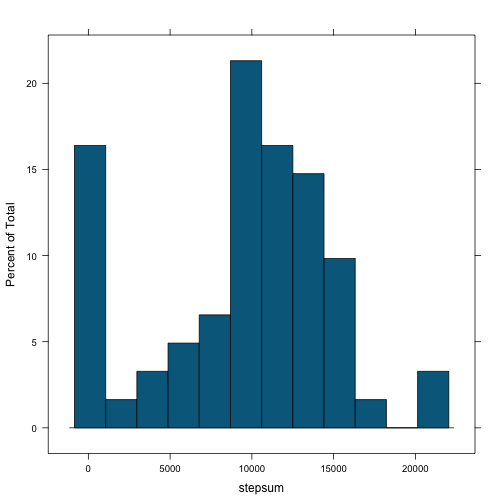
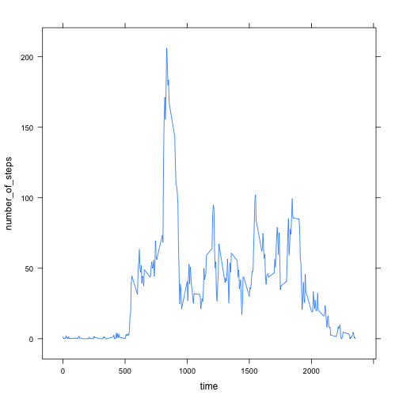
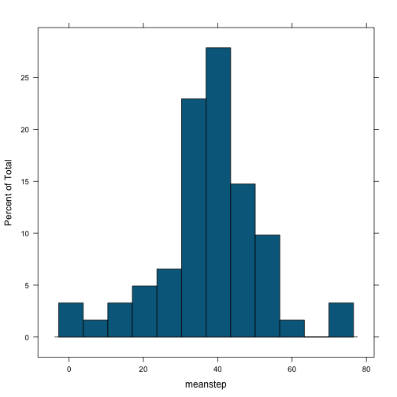
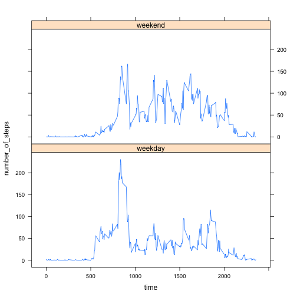

Programming Assignment 1
------------------------
### By Basile Hurat

# Data Loading and Prepping
First, we load in lattice package for later use, and load data into 'activraw'

```r
library(lattice)
activraw<-read.csv("activity.csv")
```
We then manipulate the data to create two lists based off of date and time 
respectively. 

The first is called 'activ' and is split based off of the date levels (2nd colum). 

The second one is called by 'activbytime' and is split based off of the created time
levels(3rd column).

```r
activ<-split(activraw,activraw[,2])

levels(activraw[,3])<-activraw[,3][!(duplicated(activraw[,3]))]
activbytime<-split(activraw,activraw[,3])
```
# Means, Medians, and Maxima
Then, we collect the mean of the steps each day and create a histogram using lattice. Notice that I created a function for the plot to use it again with cleaned data later on. 

```r
meanstep<-numeric()

activhist<- function(activ) {
        for (i in 1:length(activ)) {
                meanstep[i]<-mean(as.data.frame(activ[i])[,1],na.rm=TRUE)
        }
        histogram(meanstep,nint=12,col="deepskyblue4")
}
activhist(activ)
```

 
Afterwards, we collect the sum of each day and get its mean and median

```r
stepsum<-numeric()
for (i in 1:length(activ)) {
        stepsum[i]<-sum(as.data.frame(activ[i])[,1], na.rm=TRUE)
}
        
mean(stepsum, na.rm=TRUE)
```

```
## [1] 9354.23
```

```r
quantile(stepsum,probs=.5,na.rm=TRUE)
```

```
##   50% 
## 10395
```
Finally, we create a data frame. In the first column, we store the mean of steps taken within a certain 5 minute time period over every day The second column contains the time period this summary of values represents. We then plot this as a line plot using lattice.

```r
meantime<-data.frame()
for (i in 1:length(activbytime)){
        meantime[i,1]<-mean(as.data.frame(activbytime[i])[,1],na.rm=TRUE)
        meantime[i,2]<-as.data.frame(activbytime[i])[1,3]
}
colnames(meantime)<-c("number_of_steps","time")
xyplot(number_of_steps~time,data = meantime,type="l")
```

 
We then find the time interval  with the highest average number of steps recorded.

```r
for (i in 1:nrow(meantime)) {
        if (meantime[i,1] == max(meantime[,1])) {
                return(meantime[i,2])
        }
}
```

```
## [1] 835
```
# Accounting For Missing Values
Since the data set has missing values, we want to take those days with missing values and replace them with averages. We start by calculating the total amount of missing values in the data set and then replacing them with the mean for the time interval they're supposed to represent. 

```r
sum(is.na(activraw))
```

```
## [1] 2304
```

```r
activclean<-activraw
for (i in 1:nrow(activraw)) {
        if (is.na(activraw[i,1])) {
                for (j in 1:nrow(meantime)) {
                        if (activraw[i,3]==meantime[j,2]) {
                                activclean[i,1]<-meantime[j,1]
                                break
                        }
                }
        }
}
activcl<-split(activclean,activclean[,2])
```
Using the clean data, we remake the previous histogram and recalculate the mean and median. Notice that the mean and median are closer together (the same, in fact), which is to be expected.

```r
activhist(activcl)
```

 

```r
stepsumcl<-numeric()
for (i in 1:length(activcl)) {
        stepsumcl[i]<-sum(as.data.frame(activcl[i])[,1])
}
        
mean(stepsumcl)
```

```
## [1] 10766.19
```

```r
quantile(stepsumcl,probs=.5)
```

```
##      50% 
## 10766.19
```
# Weekdays
From here we work on creating a factor of weekday or weekend and append it to 'activclean' data frame

```r
for (i in 1:nrow(activclean)) {
        if (weekdays(as.POSIXct(activclean[i,2])) %in%
                    c("Monday","Tuesday","Wednesday","Thursday","Friday")) {
                activclean[i,4] <- "Weekday"
                    }
        else if (weekdays(as.POSIXct(activclean[i,2])) %in% c("Saturday","Sunday")) {
                activclean[i,4] <-"Weekend"
        }
}
```
From here, we split the clean data set by the weekday/weekend factor, and manipulate the now separate data to be split by time interval. We then take the average of each time interval for both data sets and remerge them into one. Finally, we plot the two line plots onto the same plot to easily compare the average steps per time interval on weekends versus the average steps per time interval on weekdays. 

```r
activclean[,4]<-as.factor(activclean[,4])
activweek<-split(activclean,activclean[,4])

activdayraw<-as.data.frame(activweek[1])
levels(activdayraw[,3])<-activdayraw[,3][!(duplicated(activdayraw[,3]))]
activday<-split(activdayraw,activdayraw[,3])
               
activendraw<-as.data.frame(activweek[2])
levels(activendraw[,3])<-activendraw[,3][!(duplicated(activendraw[,3]))]
activend<-split(activendraw,activendraw[,3])

meantimeday<-data.frame()
for (i in 1:length(activday)){
        meantimeday[i,1]<-as.data.frame(activday[i])[1,3]
        meantimeday[i,2]<-mean(as.data.frame(activday[i])[,1])
        meantimeday[i,3]<-as.factor("weekday")
}
colnames(meantimeday)<-c("time","number_of_steps","day")
meantimeend<-data.frame()
for (i in 1:length(activend)) {
        meantimeend[i,1]<-as.data.frame(activend[i])[1,3]
        meantimeend[i,2]<-mean(as.data.frame(activend[i])[,1])
        meantimeend[i,3]<-as.factor("weekend")
}
colnames(meantimeend)<-c("time","number_of_steps","day")

meantimeweek<-merge(meantimeday,meantimeend,all=TRUE)
xyplot(number_of_steps~time|day,data=meantimeweek,type="l",layout = c(1, 2))
```

 


